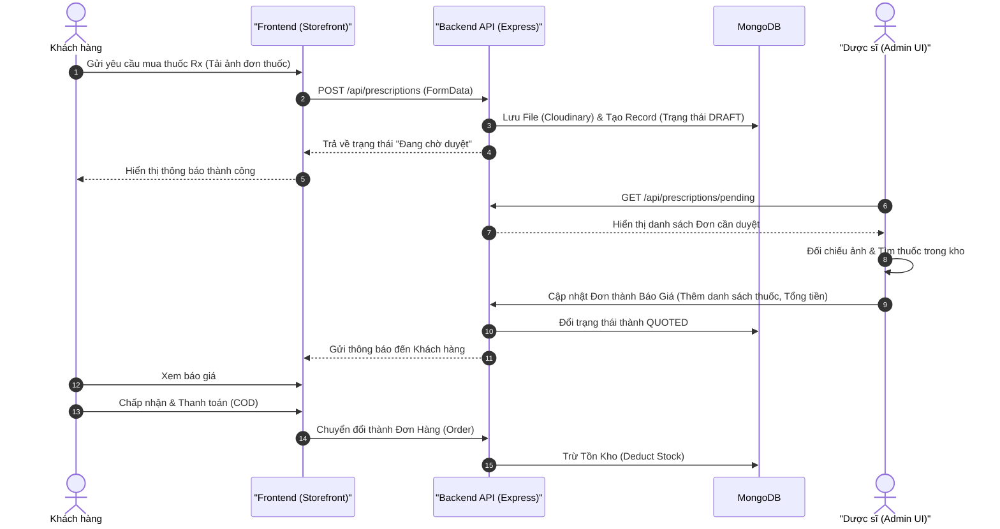

# 01_Product_Vision.md (Ý tưởng, Tầm nhìn & Phạm vi Dự án)

## 1. 🌟 Tầm nhìn Sản phẩm (Product Vision)
**Tên dự án:** PharmaCare - Hệ thống Nhà Thuốc Trực Tuyến Tích Hợp Thông Minh.

**Tầm nhìn:** Chuyển đổi số mô hình nhà thuốc truyền thống thành một trải nghiệm thương mại điện tử mượt mà. Hệ thống không chỉ giải quyết bài toán mua bán thuốc OTC (Không kê đơn) thông thường, mà còn số hóa toàn bộ quy trình xét duyệt và báo giá thuốc Rx (Kê đơn) trực tuyến một cách bảo mật, tuân thủ nghiêm ngặt các quy định về an toàn y tế.

## 2. 🎯 Bối cảnh Y tế & Bài toán Cốt lõi (The Problem)
- **Điểm đau (Pain points) của Khách hàng:** Gặp khó khăn khi phải trực tiếp đến nhà thuốc để mua các loại thuốc kê đơn (Rx). Các hệ thống e-commerce hiện tại thường bỏ qua mảng này do tính phức tạp của việc xác thực đơn thuốc.
- **Điểm đau của Dược sĩ/Quản lý:** Quy trình báo giá thủ công, kiểm soát tồn kho không chặt chẽ khi có sự pha trộn giữa thuốc OTC và Rx.
- **Giải pháp của PharmaCare:** Cung cấp một cổng thông tin duy nhất (Storefront) để khách hàng tải lên đơn thuốc, và một hệ thống Back-office (Admin Portal) độc lập để Dược sĩ dễ dàng kiểm duyệt, đối chiếu tồn kho và phản hồi báo giá theo thời gian thực.

## 3. 👥 Đối tượng Người dùng (Target Audience / Actors)
Hệ thống được thiết kế xoay quanh 3 nhóm đối tượng chính (Actors) với phân quyền rõ rệt:

1. **Khách hàng (Customer):** - Duyệt và mua sắm các sản phẩm OTC, Vitamin, Thiết bị y tế.
   - Quản lý "Sổ lưu đơn thuốc" (Prescription Vault).
   - Tải lên (Upload) hình ảnh đơn thuốc Rx để yêu cầu báo giá.
2. **Dược sĩ chuyên môn (Pharmacist):**
   - Làm việc trên Admin Portal.
   - Nhận yêu cầu báo giá, xem xét ảnh toa thuốc, tìm kiếm thuốc tương ứng trong kho và gửi báo giá lại cho khách.
3. **Quản trị viên (Admin):**
   - Quản trị toàn bộ hệ thống: Quản lý nhân sự (User Management), Quản lý Kho (Inventory).
   - Xem báo cáo thống kê, xu hướng doanh thu và cảnh báo hàng tồn kho.

## 4. 🗺️ Sơ đồ Quy trình Nghiệp vụ Cốt lõi (Core Business Flow)

> **Lưu ý cho AI:** Tham khảo sơ đồ Mermaid dưới đây để hiểu luồng tương tác giữa Khách hàng và Dược sĩ trong nghiệp vụ xử lý Thuốc Kê Đơn (Rx).

## 5. 🤖 Hướng dẫn cho AI Agent (Vibe Coding Initialization)
File này đóng vai trò là "Kim chỉ nam". Bất kỳ khi nào AI (Cursor/Windsurf) tạo ra một tính năng mới, AI BẮT BUỘC phải tự hỏi:

- *Tính năng này có phục vụ cho nghiệp vụ mua bán hoặc duyệt đơn thuốc không?*
- *Việc phân quyền (RBAC) cho tính năng này đã đúng với định nghĩa Actor ở Mục 3 chưa?*
- *Tính năng này có rơi vào danh sách "Out of Scope" (Mục 5) không? Nếu có, hãy dừng lại và hỏi ý kiến con người.*

