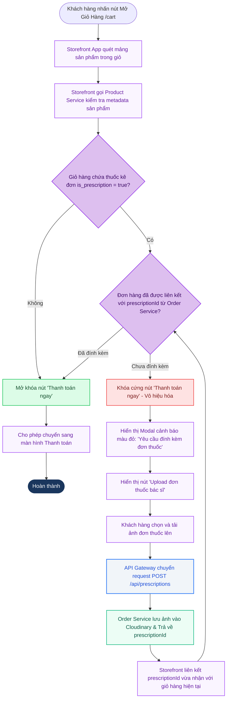
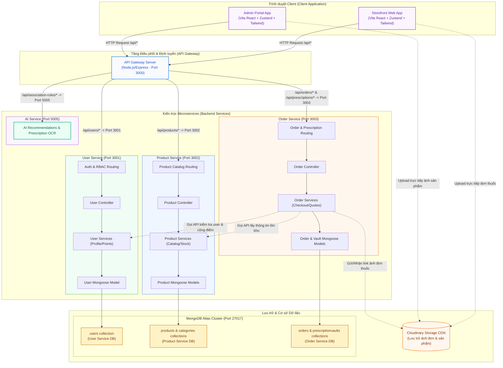
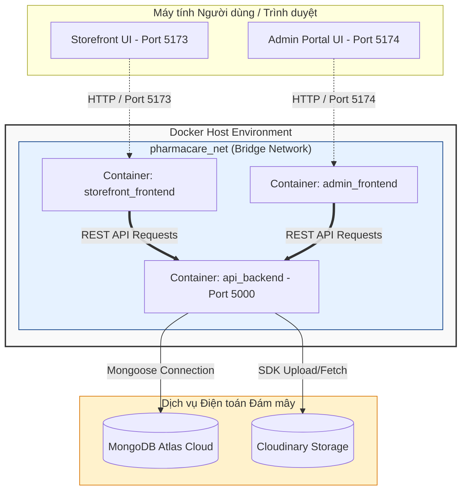

# 02_PRD_and_UserStories.md (Tài liệu Đặc tả Yêu cầu Sản phẩm & User Stories)

## 🎭 Vai trò & Bối cảnh phát triển
- **Đóng vai:** Senior Product Manager & System Architect.
- **Mục tiêu:** Cung cấp tài liệu đặc tả nghiệp vụ và kiến trúc kỹ thuật chi tiết nhất của hệ thống **PharmaCare** (Hệ thống Nhà Thuốc Trực Tuyến Tích Hợp Thông Minh). Tài liệu này được xây dựng dựa trên Hiến pháp Nghiệp vụ và Hiến pháp Kỹ thuật của dự án, đóng vai trò là cơ sở để các AI Agent sinh mã nguồn chính xác, đảm bảo tính nhất quán giữa Backend API và hai cổng Frontend (Storefront & Admin Portal).

---

## 1. 🎭 Sơ đồ Use Case Tổng Quát (General Use Case Diagram)

Sơ đồ Use Case dưới đây phân vùng rõ ranh giới hệ thống (System Boundary) thành 2 phân vùng truy cập độc lập là **Storefront** (Web Khách hàng) và **Admin Portal** (Web Nội bộ dành cho Dược sĩ & Admin), thể hiện rõ ràng quyền truy cập của các Actor tương ứng.

```mermaid
graph TB
    %% Định nghĩa các Actor với Icon/Emoji sinh động
    Customer("🎭 Khách hàng (Customer)")
    Pharmacist("🎭 Dược sĩ (Pharmacist)")
    Admin("🎭 Quản trị viên (Admin)")

    subgraph SystemBoundary["Ranh Giới Hệ Thống PharmaCare"]
        subgraph Storefront["Phân vùng Storefront (Dành cho Khách hàng - pharma.com)"]
            UC1["Tìm kiếm & Lọc sản phẩm (OTC, Rx)"]
            UC2["Quản lý giỏ hàng"]
            UC3["Gửi toa thuốc Rx (Upload ảnh đơn)"]
            UC4["Xem & Xác nhận báo giá đơn thuốc Rx"]
            UC5["Thanh toán & Chốt đơn (COD)"]
        end

        subgraph AdminPortal["Phân vùng Admin Portal (Nội bộ - pharma.com/admin)"]
            UC6["Duyệt toa thuốc & Soạn báo giá Rx (Split-screen)"]
            UC7["Khớp tồn kho & Nhận cảnh báo"]
            UC8["Quản lý người dùng & Phân quyền (RBAC)"]
            UC9["Xem Dashboard thống kê doanh thu tổng quan"]
            UC10["Quản lý kho hàng & Tồn kho đa điểm"]
        end
    end

    %% Các mối quan hệ kết nối giữa Actor và Use Case
    Customer --> UC1
    Customer --> UC2
    Customer --> UC3
    Customer --> UC4
    Customer --> UC5

    Pharmacist --> UC6
    Pharmacist --> UC7

    Admin --> UC8
    Admin --> UC9
    Admin --> UC10
    %% Admin có quyền duyệt đơn thuốc giống Dược sĩ
    Admin --> UC6
```



---

## 2. 📝 Đặc tả User Stories & Khớp Use Case (Actor-based User Stories)

Dưới đây là đặc tả chi tiết của từng User Story theo cấu trúc chuẩn quốc tế, gắn kèm Use Case tương ứng và xác định rõ hành vi nghiệp vụ, ràng buộc kỹ thuật cũng như phản hồi cụ thể trên giao diện người dùng.

### 👥 2.1. Nhóm Khách hàng (Customer) - Trực thuộc cổng Storefront

#### **US2.1: Duyệt và Tìm kiếm sản phẩm (OTC & Rx)**
*   **Cú pháp:** Là một *Khách hàng*, tôi muốn *tìm kiếm và lọc danh mục sản phẩm theo loại thuốc và dạng bào chế* để *nhanh chóng chọn đúng sản phẩm y tế cần mua.*
*   **Khớp Use Case:** `Tìm kiếm & Lọc sản phẩm (OTC, Rx)`
*   **Giao diện & Nút bấm cụ thể:**
    *   Thanh tìm kiếm (Search bar) nằm chính giữa Header, hỗ trợ tìm kiếm Real-time bằng tên thuốc hoặc hoạt chất.
    *   Bộ lọc bên trái Sidebar (Filter Sidebar) chứa các danh mục phân loại chính: `Thuốc không kê đơn (OTC)`, `Thuốc kê đơn (Rx)`, `Vitamin & Thực phẩm chức năng`, `Thiết bị y tế`, `Chăm sóc cá nhân`.
    *   Bộ lọc Dạng bào chế (Dosage Form): `Viên nén`, `Viên sủi`, `Viên nang`, `Siro`, `Dung dịch xịt`, `Thiết bị đo`.
    *   **Logic UI/Hệ thống:** Mỗi card sản phẩm hiển thị một Badge màu xanh dương cho `OTC` hoặc màu đỏ cảnh báo nguy hiểm kèm nhãn `Thuốc kê đơn (Rx)` để người dùng dễ nhận biết trước khi thêm vào giỏ.
*   **Sơ đồ Use Case cụ thể (Microservices-aligned):**
    ```mermaid
    graph LR
        classDef actor fill:#E0F2FE,stroke:#0284C7,stroke-width:2px,color:#0369A1;
        classDef uc fill:#F1F5F9,stroke:#CBD5E1,stroke-width:1.5px,color:#1E293B;

        Customer("🎭 Khách hàng (Customer)"):::actor
        
        subgraph ProductService["Dịch vụ Sản phẩm (Product Service)"]
            UC_Search["Tìm kiếm Real-time bằng tên/hoạt chất"]:::uc
            UC_FilterCat["Lọc theo Danh mục (OTC, Rx, TPCN,...)"]:::uc
            UC_FilterDosage["Lọc theo Dạng bào chế (Viên nén, siro,...)"]:::uc
            UC_ViewBadge["Nhận diện nhãn cảnh báo (OTC/Rx Badge)"]:::uc
        end

        Customer --> UC_Search
        Customer --> UC_FilterCat
        Customer --> UC_FilterDosage
        Customer --> UC_ViewBadge
    ```

#### **US2.2: Gửi toa thuốc Rx nhanh để yêu cầu báo giá**
*   **Cú pháp:** Là một *Khách hàng*, tôi muốn *tải hình ảnh đơn thuốc Rx của bác sĩ lên hệ thống và điền thông tin bổ sung* để *Dược sĩ chuyên môn xem xét kê đúng loại thuốc và gửi báo giá cho tôi.*
*   **Khớp Use Case:** `Gửi toa thuốc Rx (Upload ảnh đơn)`
*   **Giao diện & Nút bấm cụ thể:**
    *   Nút nổi bật **"Gửi toa thuốc" / "Mua thuốc theo toa"** trên Banner trang chủ hoặc Header.
    *   Trang Upload độc lập tích hợp cơ chế kéo thả hình ảnh (Drag & Drop) định dạng JPG, PNG.
    *   Form điền thông tin phụ trợ bao gồm: *Số điện thoại khách hàng (Bắt buộc)*, *Tên bác sĩ*, *Bệnh viện*, *Chẩn đoán lâm sàng*, *Ngày cấp đơn*.
    *   Nút **"Gửi yêu cầu báo giá"** ở cuối form.
    *   **Logic UI/Hệ thống:** Sau khi click gửi, hệ thống gọi API `POST /api/prescriptions` tải ảnh lên Cloudinary, lưu trữ cơ sở dữ liệu với trạng thái mặc định ban đầu là `DRAFT_RX`. Giao diện hiển thị Modal thành công: *"Hệ thống đã nhận được đơn thuốc của bạn. Dược sĩ chuyên môn của PharmaCare đang tiến hành kiểm tra toa và sẽ phản hồi báo giá trong vòng 10-15 phút."*
*   **Sơ đồ Use Case cụ thể (Microservices-aligned):**
    ```mermaid
    graph LR
        classDef actor fill:#E0F2FE,stroke:#0284C7,stroke-width:2px,color:#0369A1;
        classDef uc fill:#F1F5F9,stroke:#CBD5E1,stroke-width:1.5px,color:#1E293B;

        Customer("🎭 Khách hàng (Customer)"):::actor

        subgraph OrderService["Dịch vụ Đơn hàng & Ảnh toa (Order & Prescription Service)"]
            UC_Upload["Upload ảnh đơn thuốc (JPG, PNG)"]:::uc
            UC_FillInfo["Nhập thông tin phụ trợ (SĐT, Bác sĩ,...)"]:::uc
            UC_Submit["Gửi yêu cầu báo giá (POST /api/prescriptions)"]:::uc
            UC_SaveCloud["Lưu trữ ảnh qua Cloudinary & Tạo DRAFT_RX"]:::uc
        end

        Customer --> UC_Upload
        Customer --> UC_FillInfo
        Customer --> UC_Submit
        UC_Submit -.->|Tự động lưu| UC_SaveCloud
    ```

#### **US2.3: Giỏ hàng ràng buộc thuốc kê đơn (Cart Validation Constraints)**
*   **Cú pháp:** Là một *Khách hàng*, tôi muốn *hệ thống kiểm tra và hướng dẫn tôi đính kèm đơn thuốc khi giỏ hàng chứa sản phẩm Rx* để *đảm bảo tuân thủ quy định pháp luật về an toàn dược phẩm trước khi thanh toán.*
*   **Khớp Use Case:** `Quản lý giỏ hàng`
*   **Giao diện & Nút bấm cụ thể:**
    *   Trong trang Giỏ hàng `/cart`, nếu phát hiện sản phẩm có gắn cờ `is_prescription: true`.
    *   Hệ thống tự động vô hiệu hóa (disable) nút **"Thanh toán ngay"** (nút đổi sang màu xám, không click được).
    *   Hiển thị hộp cảnh báo màu đỏ (Alert Banner): *"Giỏ hàng của bạn chứa sản phẩm thuốc kê đơn (Rx). Vui lòng tải ảnh đơn thuốc hợp lệ lên hệ thống để tiếp tục mua hàng."*
    *   Nút bấm **"Tải đơn thuốc tại đây"** xuất hiện ngay trong Alert Banner để điều hướng người dùng tới pop-up upload đơn nhanh.
    *   **Logic UI/Hệ thống:** Hệ thống lưu trạng thái liên kết giữa ảnh đơn thuốc (`prescriptionId`) với các sản phẩm Rx trong giỏ. Chỉ khi điều kiện này được thỏa mãn, nút **"Thanh toán ngay"** mới được kích hoạt sang màu xanh để chuyển đến trang Checkout.
*   **Sơ đồ Use Case cụ thể (Microservices-aligned):**
    ```mermaid
    graph LR
        classDef actor fill:#E0F2FE,stroke:#0284C7,stroke-width:2px,color:#0369A1;
        classDef uc fill:#F1F5F9,stroke:#CBD5E1,stroke-width:1.5px,color:#1E293B;
        classDef constraint fill:#FEE2E2,stroke:#EF4444,stroke-width:2px,color:#991B1B;

        Customer("🎭 Khách hàng (Customer)"):::actor

        subgraph CartSystem["Hệ thống Giỏ hàng (Cart & Product Service)"]
            UC_ManageCart["Quản lý giỏ hàng (Thêm/Sửa/Xóa sản phẩm)"]:::uc
            UC_ScanRx["Quét sản phẩm kê đơn (is_prescription: true)"]:::uc
            UC_LockCheckout["Khóa nút Thanh toán ngay & Hiển thị Alert Banner"]:::constraint
            UC_LinkPres["Đính kèm ảnh đơn thuốc & Mở khóa nút Thanh toán"]:::uc
        end

        Customer --> UC_ManageCart
        UC_ManageCart --> UC_ScanRx
        UC_ScanRx -->|Phát hiện sản phẩm Rx| UC_LockCheckout
        Customer -->|Upload đơn thuốc bổ sung| UC_LinkPres
        UC_LinkPres -->|Thỏa mãn điều kiện| UC_ManageCart
    ```

#### **US2.4: Xác nhận báo giá từ Dược sĩ & Đặt hàng COD**
*   **Cú pháp:** Là một *Khách hàng*, tôi muốn *xem bảng báo giá chi tiết mà Dược sĩ đã tạo và bấm chốt đơn thanh toán COD* để *nhà thuốc đóng gói giao hàng tận nơi cho tôi.*
*   **Khớp Use Case:** `Xem & Xác nhận báo giá đơn thuốc Rx` kết hợp `Thanh toán & Chốt đơn (COD)`
*   **Giao diện & Nút bấm cụ thể:**
    *   Khi Dược sĩ hoàn thành báo giá, Khách hàng nhận được thông báo đỏ trong danh sách Notification.
    *   Click vào thông báo dẫn đến trang chi tiết Báo giá đơn Rx.
    *   Giao diện hiển thị danh sách các loại thuốc mà Dược sĩ đã bốc từ kho (tên thuốc, số lượng, liều dùng đề xuất từ đơn thuốc, đơn giá cụ thể) và **Tổng tiền thanh toán**.
    *   Nút **"Đồng ý & Đặt hàng ngay (COD)"** và nút **"Hủy yêu cầu"**.
    *   **Logic UI/Hệ thống:** Khi khách nhấn Đồng ý, hệ thống đổi trạng thái đơn thành `PROCESSING`, trừ tồn kho của sản phẩm tương ứng trong MongoDB thông qua API Backend, gửi tín hiệu thành công và chuyển khách hàng tới trang "Cảm ơn - Đơn hàng đang được xử lý".
*   **Sơ đồ Use Case cụ thể (Microservices-aligned):**
    ```mermaid
    graph LR
        classDef actor fill:#E0F2FE,stroke:#0284C7,stroke-width:2px,color:#0369A1;
        classDef uc fill:#F1F5F9,stroke:#CBD5E1,stroke-width:1.5px,color:#1E293B;

        Customer("🎭 Khách hàng (Customer)"):::actor

        subgraph OrderProcess["Dịch vụ Xử lý Đơn hàng (Order Service)"]
            UC_ViewQuote["Xem thông báo & Bảng báo giá chi tiết (Thuốc, số lượng, giá)"]:::uc
            UC_ConfirmCOD["Đồng ý & Đặt hàng COD (Trạng thái: PROCESSING)"]:::uc
            UC_RejectQuote["Hủy yêu cầu báo giá"]:::uc
            UC_InventoryDeduct["Tự động trừ tồn kho (Product Service)"]:::uc
        end

        Customer --> UC_ViewQuote
        Customer --> UC_ConfirmCOD
        Customer --> UC_RejectQuote
        UC_ConfirmCOD -.->|Gọi liên dịch vụ| UC_InventoryDeduct
    ```

---

### 🥼 2.2. Nhóm Dược sĩ chuyên môn (Pharmacist) - Trực thuộc cổng Admin Portal

#### **US2.5: Màn hình chia đôi (Split-screen) duyệt đơn thuốc**
*   **Cú pháp:** Là một *Dược sĩ chuyên môn*, tôi muốn *sử dụng giao diện chia đôi màn hình độc lập (ảnh đơn một bên, form bốc thuốc một bên)* để *đối chiếu ảnh chụp đơn thuốc của bác sĩ một cách chính xác và soạn nhanh bảng báo giá cho khách.*
*   **Khớp Use Case:** `Duyệt toa thuốc & Soạn báo giá Rx (Split-screen)`
*   **Giao diện & Nút bấm cụ thể:**
    *   Bảng danh sách đơn chờ duyệt tại `/admin/rx-approval`. Click vào một đơn có trạng thái `DRAFT_RX`.
    *   Mở ra giao diện Split-screen chuyên nghiệp:
        *   **Bên trái (50% chiều rộng):** Trình xem ảnh đơn thuốc trực quan (cho phép Zoom in/out, xoay ảnh 90 độ để đọc nét chữ bác sĩ).
        *   **Bên phải (50% chiều rộng):** Thanh tìm kiếm nhanh thuốc trong kho hàng thực tế của hệ thống, nút **"Thêm vào báo giá"**, các trường nhập *Số lượng*, *Liều dùng hướng dẫn*, và trường điều chỉnh đơn giá chiết khấu.
    *   Nút bấm **"Gửi báo giá cho khách"** và nút **"Từ chối đơn thuốc"** (kèm trường nhập lý do hủy đơn).
    *   **Logic UI/Hệ thống:** Khi nhấn "Gửi báo giá", trạng thái chuyển từ `DRAFT_RX` sang `QUOTED` (hoặc `PENDING_PAYMENT`). Đồng thời, thông báo đẩy (Web Socket hoặc API polling) được gửi tới tài khoản Storefront của khách hàng.
*   **Sơ đồ Use Case cụ thể (Microservices-aligned):**
    ```mermaid
    graph LR
        classDef actor fill:#FDF4FF,stroke:#D946EF,stroke-width:2px,color:#A21CAF;
        classDef uc fill:#F1F5F9,stroke:#CBD5E1,stroke-width:1.5px,color:#1E293B;

        Pharmacist("🥼 Dược sĩ (Pharmacist)"):::actor

        subgraph SplitScreenApproval["Hệ thống Phê duyệt & Soạn báo giá Rx (Order Service)"]
            UC_RxList["Xem danh sách đơn thuốc chờ duyệt (DRAFT_RX)"]:::uc
            UC_ViewImage["Xem và thao tác ảnh đơn bên trái (Zoom, Rotate)"]:::uc
            UC_AddQuote["Tìm kiếm thuốc & Thêm vào báo giá bên phải"]:::uc
            UC_SendQuote["Gửi báo giá cho khách (Trạng thái: QUOTED)"]:::uc
            UC_RejectRx["Từ chối đơn thuốc (Nhập lý do & Cancel đơn)"]:::uc
        end

        Pharmacist --> UC_RxList
        Pharmacist --> UC_ViewImage
        Pharmacist --> UC_AddQuote
        Pharmacist --> UC_SendQuote
        Pharmacist --> UC_RejectRx
    ```

#### **US2.6: Kiểm tra khớp tồn kho thực tế và cảnh báo thông minh**
*   **Cú pháp:** Là một *Dược sĩ*, tôi muốn *hệ thống tự động đối chiếu số lượng thuốc tôi nhập vào báo giá với số lượng tồn kho thực tế tại chi nhánh* để *tôi nhận diện được việc thiếu hụt hàng trước khi báo giá.*
*   **Khớp Use Case:** `Khớp tồn kho & Nhận cảnh báo`
*   **Giao diện & Nút bấm cụ thể:**
    *   Khi Dược sĩ gõ số lượng thuốc Amoxicillin là `30` viên vào form báo giá, nhưng tồn kho tại chi nhánh hiện tại chỉ còn `10` viên.
    *   Hệ thống lập tức hiển thị nhãn Warning màu cam nhấp nháy ngay dưới ô số lượng: *"Cảnh báo: Kho hàng Quận 1 chỉ còn 10 viên. Thiếu hụt 20 viên - Sẽ tự động kích hoạt điều phối từ Kho tổng khi đơn hàng được chốt."*
    *   **Logic UI/Hệ thống:** Hệ thống cảnh báo nhưng **không chặn** hành vi bấm "Gửi báo giá" của Dược sĩ nhằm tối ưu hóa chuyển đổi kinh doanh, cho phép hệ thống vận hành nạp hàng bổ sung sau (Back-order logic).
*   **Sơ đồ Use Case cụ thể (Microservices-aligned):**
    ```mermaid
    graph LR
        classDef actor fill:#FDF4FF,stroke:#D946EF,stroke-width:2px,color:#A21CAF;
        classDef uc fill:#F1F5F9,stroke:#CBD5E1,stroke-width:1.5px,color:#1E293B;
        classDef warning fill:#FEF3C7,stroke:#D97706,stroke-width:2px,color:#92400E;

        Pharmacist("🥼 Dược sĩ (Pharmacist)"):::actor

        subgraph InventoryValidation["Hệ thống Đối chiếu Kho hàng (Product & Order Service)"]
            UC_InputQuote["Nhập số lượng thuốc vào báo giá"]:::uc
            UC_CheckInventory["Gọi API kiểm tra tồn kho chi nhánh"]:::uc
            UC_ShowWarning["Hiển thị Cảnh báo tồn kho thấp (Back-order logic)"]:::warning
            UC_AllowSubmit["Cho phép gửi báo giá (Không chặn nghiệp vụ)"]:::uc
        end

        Pharmacist --> UC_InputQuote
        UC_InputQuote --> UC_CheckInventory
        UC_CheckInventory -->|Số lượng yêu cầu > Tồn kho| UC_ShowWarning
        UC_ShowWarning --> UC_AllowSubmit
        Pharmacist --> UC_AllowSubmit
    ```

---

### 👑 2.3. Nhóm Quản trị viên (Admin) - Trực thuộc cổng Admin Portal

#### **US2.7: Quản trị tài khoản người dùng và phân quyền hệ thống (RBAC)**
*   **Cú pháp:** Là một *Quản trị viên*, tôi muốn *quản lý danh sách tài khoản toàn bộ nhân sự và khách hàng trong một bảng dữ liệu động* để *phân quyền đúng vai trò hoặc xử lý khóa tài khoản vi phạm.*
*   **Khớp Use Case:** `Quản lý người dùng & Phân quyền (RBAC)`
*   **Giao diện & Nút bấm cụ thể:**
    *   Trang quản lý người dùng tại `/admin/users`.
    *   Data Table hiển thị các cột: *Tên*, *Email/SĐT*, *Vai trò (Role)*, *Trạng thái (Active/Banned)*, *Ngày tạo*.
    *   Bộ lọc tìm kiếm theo Email, lọc nhanh theo Role (`Customer`, `Pharmacist`, `Admin`).
    *   Nút bấm thay đổi quyền nhanh (Dropdown Role selector) và nút chuyển đổi trạng thái **"Ban / Unban"** tài khoản màu đỏ.
    *   **Logic UI/Hệ thống:** Khi Admin bấm "Ban", hệ thống gửi yêu cầu vô hiệu hóa token và cập nhật trạng thái `isBanned = true` vào cơ sở dữ liệu MongoDB. Người dùng bị ban sẽ lập tức bị logout khỏi phiên làm việc và không thể đăng nhập lại.
*   **Sơ đồ Use Case cụ thể (Microservices-aligned):**
    ```mermaid
    graph LR
        classDef actor fill:#FEF2F2,stroke:#EF4444,stroke-width:2px,color:#991B1B;
        classDef uc fill:#F1F5F9,stroke:#CBD5E1,stroke-width:1.5px,color:#1E293B;

        Admin("👑 Quản trị viên (Admin)"):::actor

        subgraph RBACSystem["Hệ thống Quản lý Người dùng (User Service)"]
            UC_UserTable["Xem danh sách tài khoản (Bảng dữ liệu động)"]:::uc
            UC_FilterUser["Lọc và tìm kiếm người dùng theo Email/Role"]:::uc
            UC_RoleSelect["Thay đổi vai trò (Dropdown Role Selector)"]:::uc
            UC_BanUser["Khóa / Mở khóa tài khoản (Ban/Unban)"]:::uc
            UC_InvalidateToken["Thu hồi token đăng nhập tức thì"]:::uc
        end

        Admin --> UC_UserTable
        Admin --> UC_FilterUser
        Admin --> UC_RoleSelect
        Admin --> UC_BanUser
        UC_BanUser -.->|Kích hoạt| UC_InvalidateToken
    ```

#### **US2.8: Dashboard trực quan phân tích doanh thu thực tế**
*   **Cú pháp:** Là một *Quản trị viên*, tôi muốn *xem biểu đồ trực quan thể hiện xu hướng doanh thu 7 ngày qua và tỷ lệ phân bố các trạng thái đơn hàng* để *nắm bắt tình hình kinh doanh của chuỗi hiệu thuốc.*
*   **Khớp Use Case:** `Xem Dashboard thống kê doanh thu tổng quan`
*   **Giao diện & Nút bấm cụ thể:**
    *   Trang chủ của Admin Portal `/admin/dashboard` hiển thị các thẻ chỉ số (KPI Cards): *Doanh thu tuần*, *Đơn hàng mới*, *Đơn Rx chờ duyệt*, *Tỷ lệ hoàn thành đơn*.
    *   **Biểu đồ đường (Line Chart):** Thể hiện xu hướng doanh thu tích lũy từng ngày trong 7 ngày gần nhất.
    *   **Biểu đồ tròn (Pie/Doughnut Chart):** Thể hiện tỷ trọng các trạng thái đơn hàng hiện tại (`PROCESSING`, `DELIVERED`, `CANCELLED`, `DRAFT_RX`).
    *   **Logic UI/Hệ thống:** Dữ liệu được fetch tự động từ REST API `/api/admin/dashboard-stats` tổng hợp trực tiếp từ DB. Hệ thống không sử dụng dữ liệu giả (mock data) tĩnh mà sử dụng Aggregate Queries của MongoDB để tính toán doanh thu thực tế theo thời gian thực.
*   **Sơ đồ Use Case cụ thể (Microservices-aligned):**
    ```mermaid
    graph LR
        classDef actor fill:#FEF2F2,stroke:#EF4444,stroke-width:2px,color:#991B1B;
        classDef uc fill:#F1F5F9,stroke:#CBD5E1,stroke-width:1.5px,color:#1E293B;

        Admin("👑 Quản trị viên (Admin)"):::actor

        subgraph DashboardAnalytics["Hệ thống Dashboard & Phân tích (Order & Product Service)"]
            UC_ViewKPI["Xem các thẻ KPI (Doanh thu, Đơn mới, Đơn Rx chờ)"]:::uc
            UC_ViewLineChart["Xem Biểu đồ đường Doanh thu 7 ngày qua"]:::uc
            UC_ViewPieChart["Xem Biểu đồ tròn tỷ lệ trạng thái đơn hàng"]:::uc
            UC_AggregateDB["Truy vấn tổng hợp thời gian thực (Aggregate Queries)"]:::uc
        end

        Admin --> UC_ViewKPI
        Admin --> UC_ViewLineChart
        Admin --> UC_ViewPieChart
        UC_ViewKPI -.->|Fetch Real-time DB| UC_AggregateDB
        UC_ViewLineChart -.->|Fetch Real-time DB| UC_AggregateDB
        UC_ViewPieChart -.->|Fetch Real-time DB| UC_AggregateDB
    ```

---

## 3. 🔄 Sơ đồ Luồng Hoạt động Hệ thống (System Activity Diagrams)

### 3.1. Luồng Nghiệp vụ Duyệt toa thuốc & Đặt hàng (Prescription To Order Activity Flow)

Sơ đồ thể hiện chu trình di chuyển trạng thái của một đơn thuốc kê đơn từ lúc khách hàng gửi ảnh đến khi chốt đơn thành công hoặc bị hủy bỏ, tích hợp rõ ràng vai trò của từng Microservice trong hệ thống (`api-gateway`, `user-service`, `product-service`, `order-service`).

```mermaid
graph TD
    %% Khai báo Style cho các khối để tăng tính thẩm mỹ và phân biệt Microservices
    classDef startEnd fill:#1A365D,stroke:#1A365D,stroke-width:2px,color:#fff;
    classDef gateway fill:#F1F5F9,stroke:#3B82F6,stroke-width:2px,color:#1D4ED8;
    classDef orderService fill:#ECFDF5,stroke:#10B981,stroke-width:1.5px,color:#065F46;
    classDef productService fill:#EFF6FF,stroke:#3B82F6,stroke-width:1.5px,color:#1E40AF;
    classDef userService fill:#FFF5F5,stroke:#EF4444,stroke-width:1.5px,color:#991B1B;
    classDef client fill:#FAF5FF,stroke:#A855F7,stroke-width:1.5px,color:#6B21A8;
    classDef decision fill:#DDBFEF,stroke:#9333EA,stroke-width:1.5px,color:#3B0764;
    classDef fail fill:#FEE2E2,stroke:#EF4444,stroke-width:1px,color:#7F1D1D;
    classDef success fill:#DCFCE7,stroke:#22C55E,stroke-width:1px,color:#14532D;

    Start(["Bắt đầu luồng Rx"]) --> CustUpload[Khách hàng upload ảnh đơn tại Storefront]:::client
    CustUpload --> GatewayUpload[API Gateway tiếp nhận request POST /api/prescriptions]:::gateway
    
    GatewayUpload --> OrderPresService[Order Service: Lưu trữ ảnh lên Cloudinary & Tạo record DRAFT_RX]:::orderService
    OrderPresService --> PushNotification[Order Service: Gửi thông báo real-time tới Admin Portal qua Socket/Polling]:::orderService
    
    PushNotification --> PharmSplitScreen[Dược sĩ mở màn hình Split-screen tại Admin Portal]:::client
    PharmSplitScreen --> DecisionApprove{Quyết định duyệt toa thuốc?}:::decision

    %% Rẽ nhánh từ chối đơn
    DecisionApprove -->|Từ chối - Đơn lỗi hoặc Không hợp lệ| RejectOrder[Dược sĩ bấm Từ chối đơn tại Admin Portal]:::client
    RejectOrder --> GatewayReject[API Gateway định tuyến yêu cầu hủy]:::gateway
    GatewayReject --> SetCancelled[Order Service: Cập nhật trạng thái đơn CANCELLED]:::orderService
    SetCancelled --> NotifyCustCancel[Order Service: Gửi thông báo hủy kèm lý do tới Khách hàng]:::orderService
    NotifyCustCancel --> EndFail(["Kết thúc: Đơn bị hủy"]):::fail

    %% Rẽ nhánh chấp nhận đơn
    DecisionApprove -->|Chấp nhận| BepThuoc[Dược sĩ bốc thuốc & Soạn báo giá chi tiết]:::client
    BepThuoc --> GatewayCheckStock[API Gateway định tuyến kiểm tra tồn kho]:::gateway
    GatewayCheckStock --> CheckStockInventory[Product Service: Kiểm tra tồn kho chi nhánh thực tế]:::productService
    
    CheckStockInventory --> CheckStockWarning{Kiểm tra số lượng tồn kho?}:::decision
    CheckStockWarning -->|Thiếu hàng| ShowOrangeWarning[Hiển thị cảnh báo tồn kho thấp nhưng cho phép bốc hàng tiếp]:::client
    CheckStockWarning -->|Đủ hàng| CreateQuoteTable[Tạo bảng báo giá chi tiết hoàn chỉnh]:::client
    ShowOrangeWarning --> CreateQuoteTable
    
    CreateQuoteTable --> SendQuote[Dược sĩ nhấn nút Gửi báo giá cho khách]:::client
    SendQuote --> GatewaySendQuote[API Gateway định tuyến cập nhật báo giá]:::gateway
    GatewaySendQuote --> SetStatusQuoted[Order Service: Cập nhật đơn trạng thái QUOTED]:::orderService
    SetStatusQuoted --> NotifyCustQuoted[Order Service: Thông báo đẩy báo giá thành công cho Khách hàng]:::orderService
    
    NotifyCustQuoted --> CustReviewQuote[Khách hàng xem bảng giá trên Storefront]:::client
    CustReviewQuote --> CustDecision{Khách hàng đồng ý báo giá?}:::decision

    %% Khách không đồng ý hoặc hủy bỏ
    CustDecision -->|Hủy yêu cầu hoặc Không mua| SetCancelled
    
    %% Khách đồng ý
    CustDecision -->|Đồng ý thanh toán| CheckoutCOD[Khách hàng chọn Thanh toán COD & Xác nhận đặt hàng]:::client
    CheckoutCOD --> GatewayCheckout[API Gateway tiếp nhận request chốt đơn]:::gateway
    GatewayCheckout --> GatewayDeductStock[Order Service gọi API nội bộ của Product Service]:::orderService
    GatewayDeductStock --> DeductInventory[Product Service: Tự động trừ tồn kho sản phẩm tương ứng]:::productService
    DeductInventory --> CreateOfficialOrder[Order Service: Khởi tạo đơn hàng chính thức PROCESSING]:::orderService
    
    CreateOfficialOrder --> GatewayAddPoints[Order Service gọi API nội bộ của User Service]:::orderService
    GatewayAddPoints --> AddPoints[User Service: Cộng điểm tích lũy PharmaPoints cho Khách hàng]:::userService
    AddPoints --> EndSuccess(["Kết thúc: Đặt hàng thành công"]):::success

    class Start,EndFail,EndSuccess startEnd;
```



---

### 3.2. Luồng Ràng buộc Giỏ hàng (Cart Validation Flow)

Luồng kiểm soát chặt chẽ giỏ hàng của Khách hàng, đảm bảo tính pháp lý khi có sự xuất hiện của bất kỳ sản phẩm thuốc kê đơn (Rx) nào, kết nối trực tiếp Client và các dịch vụ Backend API qua API Gateway.



---

## 4. 🧱 Sơ đồ Thành phần Hệ thống (Component Diagram)

Sơ đồ mô tả cấu trúc thiết kế kiến trúc của PharmaCare theo mô hình **Microservices Architecture**, phân rã rõ ràng ranh giới nghiệp vụ (Bounded Context) giữa các service độc lập, các cơ sở dữ liệu biệt lập theo đúng Hiến pháp Kỹ thuật dự án.



---

## 5. 🚀 Sơ đồ Triển khai bằng Docker (Deployment Diagram)

Hệ thống ứng dụng mô hình ảo hóa bằng Docker để đóng gói hoàn chỉnh môi trường phát triển thành các container độc lập, kết nối với nhau qua một mạng nội bộ (bridge network).



### 📦 Ràng buộc kỹ thuật chi tiết của các Container (Docker Specifications)

Khi tiến hành khởi tạo cấu trúc dự án (Scaffolding), AI Agent phải thiết lập môi trường Docker tuân thủ các thông số cấu hình sau:

#### **1. frontend-storefront (Container chạy ứng dụng cho Khách hàng):**
- **Base Image:** `node:20-alpine` (để tối ưu dung lượng).
- **Môi trường:** Chạy ở chế độ Development với Vite.
- **Cổng ánh xạ (Port Mapping):** `5173:5173`.
- **Volume Mount:** Gắn đồng bộ thư mục `./frontend` để hỗ trợ Hot-Reload khi chỉnh sửa UI giao diện.

#### **2. frontend-admin (Container chạy ứng dụng Quản trị cho Dược sĩ):**
- **Base Image:** `node:20-alpine`.
- **Môi trường:** Chạy ở chế độ Development với Vite.
- **Cổng ánh xạ (Port Mapping):** `5174:5174`.
- **Volume Mount:** Gắn đồng bộ thư mục `./admin`.

#### **3. backend-api (Container xử lý logic nghiệp vụ và kết nối DB):**
- **Base Image:** `node:20-alpine`.
- **Cổng ánh xạ (Port Mapping):** `5000:5000`.
- **Biến môi trường (Environment Variables):** Đọc trực tiếp từ file `.env` ở thư mục gốc (bao gồm `MONGO_URI`, `JWT_SECRET`, và các thông số kết nối `Cloudinary`).
- **Volume Mount:** Gắn thư mục `./backend`, loại trừ `node_modules` thông qua `.dockerignore` để tránh xung đột thư viện giữa máy host và container.
