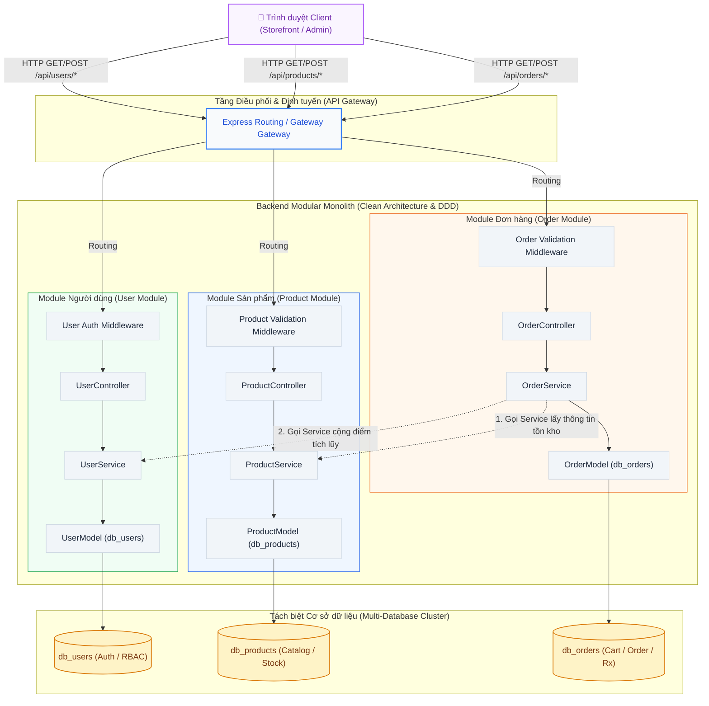
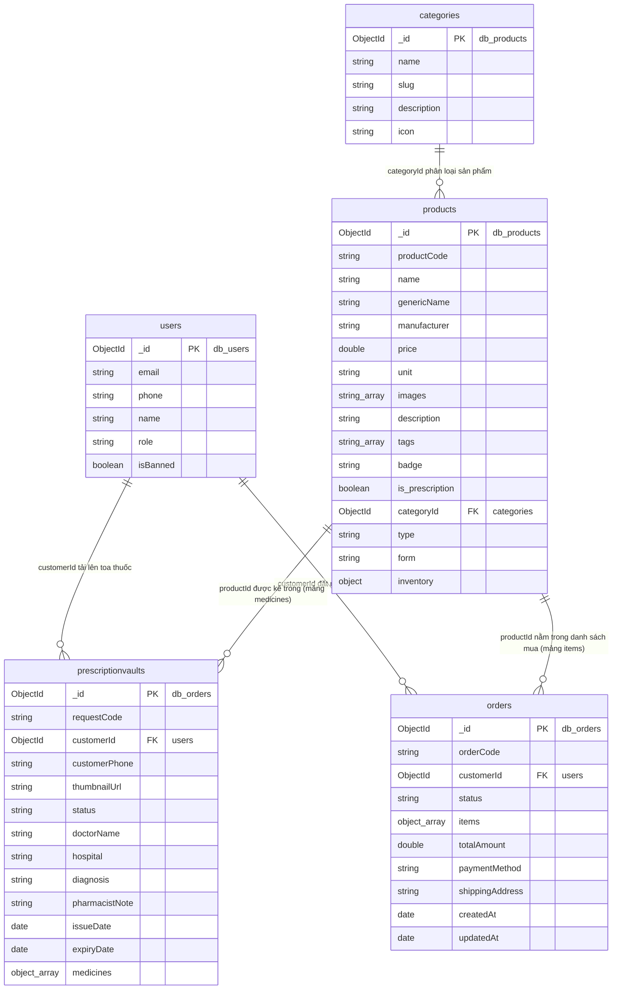

# 03_Architecture_&_Database.md (Tài liệu Kiến trúc Codebase & Đặc tả Cơ sở dữ liệu)

## 🎭 Vai trò & Bối cảnh phát triển
- **Đóng vai:** Senior System Architect & Lead Database Engineer.
- **Mục tiêu:** Cung cấp tài liệu quy định kiến trúc mã nguồn (Codebase Architecture) và đặc tả chi tiết cấu trúc dữ liệu (Database Schema Blueprints) của hệ thống **PharmaCare**.
- **Hiệu lực thi hành:** Tài liệu này đóng vai trò là "Kim chỉ nam" nghiệp vụ và kỹ thuật. Toàn bộ các AI Agent và thành viên dự án khi tham gia lập trình Backend (Express) và Model (Mongoose) **bắt buộc phải tuân thủ 100%**, tuyệt đối không tự ý thêm bớt các trường dữ liệu, cấu trúc thư mục hoặc thay đổi mối quan hệ nghiệp vụ khi chưa có phê duyệt chính thức.

---

## 1. 🏗️ Chiến lược Kiến trúc: Modular Monolith hướng Microservices

Hệ thống **PharmaCare** được định hướng phát triển theo chiến lược **Modular Monolith** kết hợp triết lý **Domain-Driven Design (DDD)**. Chiến lược này giúp tối ưu hóa chi phí vận hành, triển khai trong giai đoạn đầu nhưng vẫn đảm bảo tính độc lập tuyệt đối giữa các nghiệp vụ để dễ dàng bẻ tách thành các Microservices độc lập trong tương lai.

### 🛡️ Luật Đóng gói & Ràng buộc Giao tiếp (Encapsulation Rules)
1. **Chia nhỏ Domain (Domain-Driven Design):** Hệ thống mã nguồn Backend tập trung (Monolith) được phân tách thành 3 module nghiệp vụ hoàn chỉnh và độc lập:
   - **`User Module`**: Quản lý thông tin tài khoản, đăng nhập, bảo mật và phân quyền (RBAC).
   - **`Product Module`**: Quản lý danh mục hàng hóa, chi tiết thuốc (OTC, Rx) và quản lý tồn kho.
   - **`Order Module`**: Quản lý giỏ hàng, đặt hàng (OTC, Rx), duyệt ảnh toa thuốc bác sĩ và báo giá.
2. **Nghiêm cấm truy vấn chéo dữ liệu trực tiếp (No Cross-Querying):**
   - Controller/Service của module này **tuyệt đối không được phép import Model hoặc query trực tiếp Database của module khác**.
   - Mọi tương tác, đồng bộ hoặc lấy thông tin giữa các Domain phải đi qua **Service Layer** thông qua các hàm API nội bộ (Internal Service Calls) hoặc Event Bus trong tương lai.
   - *Ví dụ:* Khi `OrderService` cần kiểm tra tồn kho của sản phẩm, nó phải gọi hàm `ProductService.checkStock(productId, quantity)` thay vì import `ProductModel` và thực hiện `ProductModel.findById(...)`.

### 📊 Sơ đồ Kiến trúc thành phần (Mermaid Component Diagram)
Dưới đây là luồng đi của một Request đi qua các Layer độc lập trong kiến trúc Modular Monolith:



---

## 2. 🗄️ Phân vùng Cơ sở dữ liệu (Multi-Database Isolation)

Để mô phỏng hoàn chỉnh kiến trúc Microservices và đảm bảo tính cô lập dữ liệu cao nhất, ứng dụng triển khai giải pháp **Multi-Database Connection Isolation** trên MongoDB. 

Bộ mã nguồn Backend API sử dụng cơ chế thiết lập nhiều phiên kết nối Mongoose (`mongoose.createConnection`) để trỏ riêng biệt vào các Cơ sở dữ liệu vật lý khác nhau:

- **`db_users`**: Quản lý tài khoản khách hàng, dược sĩ, quản trị viên, thông tin định danh và phân quyền RBAC (`User` Schema).
- **`db_products`**: Quản lý danh mục hàng hóa (`Category` Schema), thông tin chi tiết thuốc (`Product` Schema) và số lượng tồn kho đa điểm thực tế.
- **`db_orders`**: Quản lý giỏ hàng tạm thời, lịch sử hóa đơn (`Order` Schema) và kho lưu trữ đơn thuốc bác sĩ đã tải lên hệ thống (`PrescriptionVault` Schema).

### 🖥️ Code mẫu thiết lập cấu hình kết nối Mongoose (db.ts)

```typescript
import mongoose, { Connection } from 'mongoose';
import dotenv from 'dotenv';

dotenv.config();

const MONGO_URI = process.env.MONGO_URI || 'mongodb://localhost:27017';

// Khởi tạo các kết nối độc lập trỏ vào các database tương ứng
export const userConnection: Connection = mongoose.createConnection(`${MONGO_URI}/db_users`);
export const productConnection: Connection = mongoose.createConnection(`${MONGO_URI}/db_products`);
export const orderConnection: Connection = mongoose.createConnection(`${MONGO_URI}/db_orders`);

// Kiểm tra trạng thái các kết nối
userConnection.on('connected', () => console.log('📁 Connected to db_users successfully!'));
productConnection.on('connected', () => console.log('📁 Connected to db_products successfully!'));
orderConnection.on('connected', () => console.log('📁 Connected to db_orders successfully!'));
```

---

## 3. 📊 Sơ đồ Quan hệ Thực thể (ERD Diagram cho NoSQL)

Trong cơ sở dữ liệu Document-based (NoSQL như MongoDB), các tài liệu liên kết với nhau bằng cách lưu trữ mã định danh `ObjectId` của tài liệu khác (Mô phỏng Foreign Key). Sơ đồ quan hệ thực thể dưới đây mô tả chính xác cách phân vùng và liên kết dữ liệu giữa các Collection:



---

## 4. 📝 Đặc tả chi tiết Mongoose Schemas (Blueprints)

Dưới đây là mã nguồn mẫu Schema viết bằng **TypeScript / Mongoose** chuẩn hóa. Các trường, kiểu dữ liệu, các ràng buộc validate (required, unique, enum, min, trim) phải được cấu hình chính xác 100% trong mã nguồn dự án.

---

### 📂 4.1. Module Dữ liệu Sản phẩm (db_products)

#### **Collection: `categories`**
Collection này phân loại các nhóm sản phẩm y tế và thiết bị trong nhà thuốc.

```typescript
import { Schema, Document, Types } from 'mongoose';
import { productConnection } from '../config/db';

export interface ICategory extends Document {
  _id: Types.ObjectId;
  name: string;
  slug: string;
  description?: string;
  icon?: string;
  createdAt: Date;
  updatedAt: Date;
}

export const CategorySchema = new Schema<ICategory>(
  {
    name: { 
      type: String, 
      required: [true, 'Tên danh mục là bắt buộc'], 
      trim: true 
    },
    slug: { 
      type: String, 
      required: [true, 'Slug định danh danh mục là bắt buộc'], 
      unique: true, 
      lowercase: true, 
      trim: true 
    },
    description: { 
      type: String, 
      default: '' 
    },
    icon: { 
      type: String, 
      default: '' 
    }
  },
  { 
    timestamps: true 
  }
);

// Khởi tạo Model gắn với Connection cụ thể (db_products)
export const CategoryModel = productConnection.model<ICategory>('Category', CategorySchema);
```

---

#### **Collection: `products`**
**LƯU Ý CỨNG:** Tuyệt đối **KHÔNG** thêm các trường `rating` (đánh giá sao) và `reviewCount` (số lượng đánh giá) vào Collection này do đã được cắt bỏ theo hiến pháp tối giản giao diện.

```typescript
import { Schema, Document, Types } from 'mongoose';
import { productConnection } from '../config/db';

export interface IBranchInventory {
  branchName: string;
  stock_quantity: number;
}

export interface IInventory {
  total_stock: number;
  branches: IBranchInventory[];
}

export interface IProduct extends Document {
  _id: Types.ObjectId;
  productCode: string;
  name: string;
  genericName: string; // Tên hoạt chất y khoa chính (ví dụ: Paracetamol)
  manufacturer: string; // Hãng/Nhà sản xuất (ví dụ: Dược Hậu Giang)
  price: number;
  unit: string; // Đơn vị tính cơ bản (ví dụ: Viên, Hộp, Vỉ, Chai)
  images: string[]; // Danh sách URL hình ảnh thật từ Cloudinary hoặc placeholder
  description: string; // Mô tả chi tiết cách dùng, chỉ định
  tags: string[]; // Mảng từ khóa hỗ trợ Search Engine (ví dụ: ['Hạ sốt', 'Giảm đau'])
  badge?: string; // Nhãn nổi bật hiển thị trên UI (ví dụ: 'Bán chạy', 'Sản phẩm mới')
  is_prescription: boolean; // true: Thuốc kê đơn Rx (cần đơn thuốc), false: Thuốc OTC / TPCN
  categoryId: Types.ObjectId; // Liên kết khóa ngoại trỏ sang Collection categories
  type: 'otc' | 'rx' | 'vitamin' | 'personal_care' | 'medical_device';
  form: 'tablet' | 'capsule' | 'liquid' | 'device' | 'effervescent';
  inventory: IInventory; // Thông tin kho tổng và kho các chi nhánh vật lý
  createdAt: Date;
  updatedAt: Date;
}

export const ProductSchema = new Schema<IProduct>(
  {
    productCode: { 
      type: String, 
      required: [true, 'Mã sản phẩm (productCode) là bắt buộc'], 
      unique: true, 
      uppercase: true, 
      trim: true 
    },
    name: { 
      type: String, 
      required: [true, 'Tên thương mại sản phẩm là bắt buộc'], 
      trim: true 
    },
    genericName: { 
      type: String, 
      required: [true, 'Tên hoạt chất y khoa là bắt buộc'], 
      trim: true 
    },
    manufacturer: { 
      type: String, 
      required: [true, 'Nhà sản xuất là bắt buộc'], 
      trim: true 
    },
    price: { 
      type: Number, 
      required: [true, 'Giá bán là bắt buộc'], 
      min: [0, 'Giá bán không được nhỏ hơn 0'] 
    },
    unit: { 
      type: String, 
      required: [true, 'Đơn vị tính là bắt buộc'], 
      trim: true 
    },
    images: { 
      type: [String], 
      default: [] 
    },
    description: { 
      type: String, 
      required: [true, 'Mô tả chi tiết sản phẩm là bắt buộc'] 
    },
    tags: { 
      type: [String], 
      default: [] 
    },
    badge: { 
      type: String, 
      default: '' 
    },
    is_prescription: { 
      type: Boolean, 
      required: true, 
      default: false 
    },
    categoryId: { 
      type: Schema.Types.ObjectId, 
      ref: 'Category', 
      required: [true, 'Danh mục phân loại là bắt buộc'] 
    },
    type: {
      type: String,
      required: true,
      enum: {
        values: ['otc', 'rx', 'vitamin', 'personal_care', 'medical_device'],
        message: 'Type phải thuộc một trong các giá trị: otc, rx, vitamin, personal_care, medical_device'
      }
    },
    form: {
      type: String,
      required: true,
      enum: {
        values: ['tablet', 'capsule', 'liquid', 'device', 'effervescent'],
        message: 'Dạng bào chế (form) phải là: tablet, capsule, liquid, device, effervescent'
      }
    },
    inventory: {
      total_stock: { 
        type: Number, 
        required: true, 
        min: 0, 
        default: 0 
      },
      branches: [
        {
          branchName: { type: String, required: true },
          stock_quantity: { type: Number, required: true, min: 0, default: 0 }
        }
      ]
    }
  },
  { 
    timestamps: true 
  }
);

export const ProductModel = productConnection.model<IProduct>('Product', ProductSchema);
```

---

### 📂 4.2. Module Đơn hàng & Quản lý Toa thuốc (db_orders)

#### **Collection: `prescriptionvaults`**
Kho lưu trữ ảnh chụp đơn thuốc y khoa của khách hàng tải lên. Khi Dược sĩ duyệt xong, thông tin thuốc bốc thực tế từ đơn sẽ được cập nhật chi tiết vào mảng `medicines`.

```typescript
import { Schema, Document, Types } from 'mongoose';
import { orderConnection } from '../config/db';

export interface IPrescriptionMedicine {
  productId: Types.ObjectId; // Liên kết khóa ngoại trỏ sang db_products.products
  name: string; // Tên thuốc bốc trong hệ thống
  quantity: number; // Số lượng thuốc bốc
  price: number; // Đơn giá bốc thực tế thời điểm duyệt toa (đối chiếu để tạo báo giá)
}

export interface IPrescriptionVault extends Document {
  _id: Types.ObjectId;
  requestCode: string; // Mã yêu cầu duyệt đơn y tế tự sinh (Ví dụ: RX-20260520-009)
  customerId: Types.ObjectId; // Khóa ngoại trỏ sang tài khoản khách hàng ở db_users
  customerPhone: string; // Số điện thoại liên hệ xác nhận báo giá nhanh
  thumbnailUrl: string; // Đường dẫn URL ảnh chụp toa thuốc thực tế bác sĩ kê, lưu trữ trên Cloudinary
  status: 'PENDING' | 'APPROVED' | 'REJECTED';
  doctorName?: string; // Tên bác sĩ ký đơn
  hospital?: string; // Tên bệnh viện / phòng khám
  diagnosis?: string; // Chẩn đoán bệnh lâm sàng
  pharmacistNote?: string; // Ghi chú hướng dẫn sử dụng/lý do từ chối của Dược sĩ
  issueDate: Date; // Ngày bác sĩ ký cấp toa thuốc y khoa
  expiryDate: Date; // Hạn dùng của toa y tế (Mặc định tự động = issueDate + 30 ngày)
  medicines: IPrescriptionMedicine[]; // Mảng chứa danh sách thuốc thực tế được bốc từ kho hàng
  createdAt: Date;
  updatedAt: Date;
}

export const PrescriptionVaultSchema = new Schema<IPrescriptionVault>(
  {
    requestCode: { 
      type: String, 
      required: true, 
      unique: true, 
      uppercase: true, 
      trim: true 
    },
    customerId: { 
      type: Schema.Types.ObjectId, 
      required: true 
    },
    customerPhone: { 
      type: String, 
      required: [true, 'Số điện thoại khách hàng là bắt buộc để liên hệ báo giá'], 
      trim: true 
    },
    thumbnailUrl: { 
      type: String, 
      required: [true, 'Hình ảnh đơn thuốc tải lên là bắt buộc'] 
    },
    status: {
      type: String,
      required: true,
      enum: ['PENDING', 'APPROVED', 'REJECTED'],
      default: 'PENDING'
    },
    doctorName: { 
      type: String, 
      default: '' 
    },
    hospital: { 
      type: String, 
      default: '' 
    },
    diagnosis: { 
      type: String, 
      default: '' 
    },
    pharmacistNote: { 
      type: String, 
      default: '' 
    },
    issueDate: { 
      type: Date, 
      required: [true, 'Ngày bác sĩ cấp đơn thuốc là bắt buộc'] 
    },
    expiryDate: {
      type: Date,
      required: true,
      default: function (this: IPrescriptionVault) {
        // Tự động tính toán expiryDate = issueDate + 30 ngày (2592000000 ms)
        return new Date(this.issueDate.getTime() + 30 * 24 * 60 * 60 * 1000);
      }
    },
    medicines: [
      {
        productId: { type: Schema.Types.ObjectId, required: true },
        name: { type: String, required: true },
        quantity: { type: Number, required: true, min: [1, 'Số lượng tối thiểu là 1'] },
        price: { type: Number, required: true, min: [0, 'Đơn giá không thể nhỏ hơn 0'] }
      }
    ]
  },
  { 
    timestamps: true 
  }
);

// Middleware tự động đồng bộ hóa gia hạn expiryDate khi có cập nhật sửa đổi issueDate
PrescriptionVaultSchema.pre('save', function (next) {
  if (this.isModified('issueDate')) {
    this.expiryDate = new Date(this.issueDate.getTime() + 30 * 24 * 60 * 60 * 1000);
  }
  next();
});

export const PrescriptionVaultModel = orderConnection.model<IPrescriptionVault>('PrescriptionVault', PrescriptionVaultSchema);
```

---

#### **Collection: `orders`**
Collection này lưu trữ hóa đơn mua hàng của khách gồm cả thuốc không kê đơn OTC, TPCN thông thường hoặc báo giá toa Rx đã được khách hàng đồng ý chốt đơn. Trạng thái đơn được kiểm soát nghiêm ngặt theo mô hình State Machine.

```typescript
import { Schema, Document, Types } from 'mongoose';
import { orderConnection } from '../config/db';

export interface IOrderItem {
  productId: Types.ObjectId; // Liên kết khóa ngoại trỏ sang db_products.products
  name: string; // Tên hiển thị sản phẩm thời điểm mua hàng
  quantity: number; // Số lượng mua
  price: number; // Đơn giá thanh toán thực tế tại thời điểm mua
  unit: string; // Đơn vị tính (Hộp, Viên,...)
}

export interface IOrder extends Document {
  _id: Types.ObjectId;
  orderCode: string; // Mã đơn hàng (Ví dụ: ORD-20260520-7798)
  customerId: Types.ObjectId; // Khóa ngoại trỏ sang tài khoản khách hàng ở db_users
  status: 'DRAFT_RX' | 'QUOTED' | 'PENDING_PAYMENT' | 'PROCESSING' | 'SHIPPING' | 'COMPLETED' | 'CANCELLED';
  items: IOrderItem[]; // Mảng danh sách sản phẩm mua hàng
  totalAmount: number; // Tổng giá trị đơn hàng
  paymentMethod: 'COD' | 'TRANSFER'; // Hình thức thanh toán: COD (Tiền mặt), TRANSFER (Chuyển khoản)
  shippingAddress: string; // Địa chỉ nhận thuốc chi tiết
  createdAt: Date;
  updatedAt: Date;
}

export const OrderSchema = new Schema<IOrder>(
  {
    orderCode: { 
      type: String, 
      required: true, 
      unique: true, 
      uppercase: true, 
      trim: true 
    },
    customerId: { 
      type: Schema.Types.ObjectId, 
      required: [true, 'ID Khách hàng đặt mua là bắt buộc'] 
    },
    status: {
      type: String,
      required: true,
      enum: {
        values: [
          'DRAFT_RX',         // Đơn thuốc Rx vừa tải lên hình ảnh, đang chờ Dược sĩ duyệt bốc thuốc
          'QUOTED',           // Dược sĩ đã duyệt xong, bốc thuốc & gửi bảng báo giá cho Khách hàng
          'PENDING_PAYMENT',  // Khách đồng ý báo giá, chờ kiểm tra thanh toán (nếu chọn Chuyển khoản)
          'PROCESSING',       // Đơn hàng đang được soạn thuốc, đóng gói tại chi nhánh
          'SHIPPING',         // Đơn hàng đã giao cho shipper, đang trên đường vận chuyển
          'COMPLETED',        // Khách đã nhận thuốc thành công và thanh toán hoàn tất
          'CANCELLED'         // Đơn hàng bị hủy bỏ (Do từ chối duyệt toa thuốc hoặc khách hủy)
        ],
        message: 'Trạng thái đơn hàng (status) không hợp lệ!'
      },
      default: 'PROCESSING' // Đối với đơn hàng OTC mua thông thường không cần duyệt đơn thuốc
    },
    items: [
      {
        productId: { type: Schema.Types.ObjectId, required: true },
        name: { type: String, required: true },
        quantity: { type: Number, required: true, min: [1, 'Số lượng mua tối thiểu là 1'] },
        price: { type: Number, required: true, min: [0, 'Đơn giá sản phẩm không thể nhỏ hơn 0'] },
        unit: { type: String, required: true }
      }
    ],
    totalAmount: { 
      type: Number, 
      required: [true, 'Tổng tiền đơn hàng là bắt buộc'], 
      min: [0, 'Tổng tiền không được nhỏ hơn 0'] 
    },
    paymentMethod: {
      type: String,
      required: true,
      enum: ['COD', 'TRANSFER'],
      default: 'COD'
    },
    shippingAddress: { 
      type: String, 
      required: [true, 'Địa chỉ giao hàng là bắt buộc'], 
      trim: true 
    }
  },
  { 
    timestamps: true 
  }
);

export const OrderModel = orderConnection.model<IOrder>('Order', OrderSchema);
```

---

### 📂 4.3. Module Tài khoản & Phân quyền (db_users)

#### **Collection: `users`**
Collection này dùng để kiểm tra tính danh thực và phân quyền truy cập thông tin của khách hàng hoặc nội bộ (Dược sĩ, Admin) trong toàn hệ thống.

```typescript
import { Schema, Document, Types } from 'mongoose';
import { userConnection } from '../config/db';

export interface IUser extends Document {
  _id: Types.ObjectId;
  email: string;
  phone: string;
  passwordHash: string;
  name: string;
  role: 'Customer' | 'Pharmacist' | 'Admin'; // Role phân quyền hệ thống (RBAC)
  isBanned: boolean; // Trạng thái khóa tài khoản
  points: number; // Điểm tích lũy tích lũy PharmaPoints
  createdAt: Date;
  updatedAt: Date;
}

export const UserSchema = new Schema<IUser>(
  {
    email: { 
      type: String, 
      required: [true, 'Email tài khoản là bắt buộc'], 
      unique: true, 
      lowercase: true, 
      trim: true 
    },
    phone: { 
      type: String, 
      required: [true, 'Số điện thoại là bắt buộc'], 
      unique: true, 
      trim: true 
    },
    passwordHash: { 
      type: String, 
      required: [true, 'Mật khẩu băm (Password Hash) là bắt buộc'] 
    },
    name: { 
      type: String, 
      required: [true, 'Tên người dùng hiển thị là bắt buộc'], 
      trim: true 
    },
    role: {
      type: String,
      required: true,
      enum: ['Customer', 'Pharmacist', 'Admin'],
      default: 'Customer'
    },
    isBanned: { 
      type: Boolean, 
      required: true, 
      default: false 
    },
    points: { 
      type: Number, 
      required: true, 
      min: 0, 
      default: 0 
    }
  },
  { 
    timestamps: true 
  }
);

export const UserModel = userConnection.model<IUser>('User', UserSchema);
```
