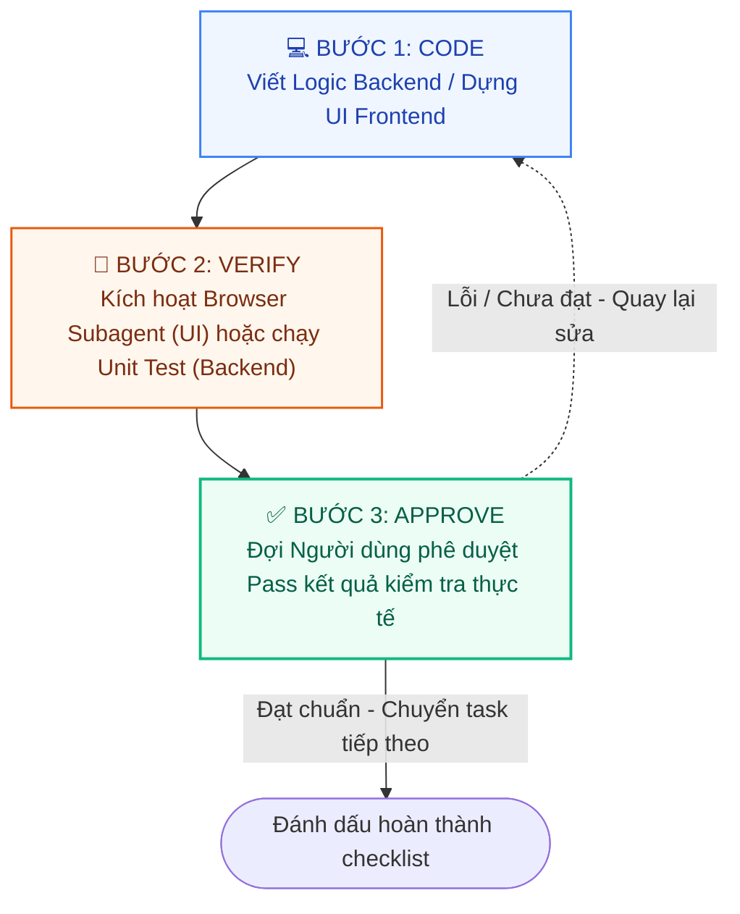

# 05_Project_Roadmap.md (Lộ trình Triển khai & Quy trình Kiểm thử liên tục)

## 🎭 Vai trò & Bối cảnh phát triển
- **Đóng vai:** Senior Project Manager & QA Lead.
- **Mục tiêu:** Định hình lộ trình phát triển chi tiết từng giai đoạn (Milestones) của hệ thống **PharmaCare** chạy trên kiến trúc **Microservices** phân rã dịch vụ thực tế.
- **Trạng thái Dự án:** **HOÀN THÀNH 100% (COMPLETED)**. Toàn bộ các checklist dưới đây đã được nghiệm thu thành công và đánh dấu tích `[x]`.

---

## 🌟 Nguyên tắc Vòng lặp Kiểm thử (TDD & Vibe Coding Loop)

Để đảm bảo mã nguồn luôn hoạt động ổn định và không phát sinh lỗi bất ngờ (regression bugs), AI Agent khi thực hiện bất kỳ nhiệm vụ nào trong lộ trình đều tuân thủ tuyệt đối **Vòng lặp 3 Bước** dưới đây trước khi chuyển sang nhiệm vụ tiếp theo:

1. **💻 CODE (Lập trình):** AI Agent tiếp nhận nhiệm vụ, phát triển logic, thiết kế UI dựa trên các đặc tả PRD và Schema đã quy định sẵn.
2. **🧪 VERIFY (Xác thực liên tục):**
   - **Đối với Frontend/UI:** AI Agent kích hoạt `Browser Subagent` mở trình duyệt kiểm tra visual, các sự kiện nhấp chuột, nhập liệu, đảm bảo không lỗi trắng màn hình.
   - **Đối với Backend/API:** Viết và chạy trực tiếp các bộ unit test (`*.test.ts` hoặc `*.test.js`) sử dụng Mocha/Chai/Jest để xác thực tính toàn vẹn của API.
3. **✅ APPROVE (Người dùng Phê duyệt):** Hiển thị minh chứng kiểm thử (Test Logs/Screenshots). Đợi người dùng phản hồi xác nhận Pass kết quả kiểm tra thực tế mới được phép tick `[x]` vào checklist và chuyển sang tính năng kế tiếp.

---

## 📅 Lộ trình Triển khai Dự án (Project Phases)

---

### Phase 1: 🏗️ Khởi tạo Hạ tầng & Khung xương Microservices
*Giai đoạn thiết lập nền tảng dự án, cấu hình môi trường ảo hóa Docker để toàn bộ đội ngũ phát triển và hệ thống CI/CD đồng nhất môi trường với 5 dịch vụ backend độc lập.*

- [x] Khởi tạo cấu trúc mã nguồn Frontend Storefront (`/Frontend` - Cổng 5173) và Admin Portal (`/Admin` - Cổng 5174) bằng **Vite + React (TypeScript)**.
- [x] Khởi tạo mã nguồn 5 Microservices tại `/Backend` sử dụng Node.js/Express (TypeScript) và Python (FastAPI):
  - [x] `api-gateway` (Cổng 3000): Tiếp nhận định tuyến request.
  - [x] `user-service` (Cổng 3001): Quản lý tài khoản, RBAC và tích lũy điểm PharmaPoints.
  - [x] `product-service` (Cổng 3002): Quản lý danh mục, thông tin thuốc và tồn kho.
  - [x] `order-service` (Cổng 3003): Quản lý giỏ hàng, đơn thuốc y tế và hóa đơn đặt hàng.
  - [x] `ai-service` (Cổng 8000): Python FastAPI cung cấp giải thuật khai phá luật kết hợp (Association Rules).
- [x] Viết file cấu hình mạng ảo và ảo hóa container `docker-compose.yml` điều phối toàn bộ các dịch vụ kết nối chung mạng bridge `medicine-network`.
- [x] Thiết lập file `.dockerignore` và cấu hình biến môi trường `.env` cho từng service.

> [!IMPORTANT]
> #### 🧪 HOẠT ĐỘNG KIỂM THỬ 1 (Hạ tầng Container)
> - **Cách thức kiểm thử:** Kích hoạt môi trường và khởi chạy lệnh `docker compose up --build`.
> - **Tiêu chí Pass:** 
>   - Toàn bộ các Container khởi chạy thành công ở chế độ Development.
>   - Truy cập giao diện thông qua `localhost:5173` và `localhost:5174` hiển thị trang chào mừng của Vite/React.
>   - Gửi yêu cầu kiểm tra sức khỏe tới `http://localhost:3000/api/health` hoặc các port dịch vụ trả về trạng thái `HTTP 200 OK` ổn định.

---

### Phase 2: 🗄️ Thiết kế Database & Móng Core Services
*Triển khai cấu trúc lưu trữ MongoDB cô lập vật lý cho từng microservice và nạp dữ liệu mồi y tế chuẩn hóa.*

- [x] Cấu hình thiết lập kết nối Database biệt lập cho từng service: `user-service` kết nối `db_users`, `product-service` kết nối `db_products`, và `order-service` kết nối `db_orders` qua Mongoose.
- [x] Định nghĩa chi tiết các Mongoose Models bằng TypeScript dựa trên [03_Architecture_&_Database.md](file:///d:/Seminar_git/Seminar_ChuyenDe_nhom/DoAN/.docs/03_Architecture_&_Database.md):
  - [x] `product-service`: Schema `Category` và `Product` (Không có rating và reviewCount).
  - [x] `user-service`: Schema `User` (RBAC, PharmaPoints).
  - [x] `order-service`: Schema `Order` (State Machine) và `PrescriptionVault` (Auto tính hạn dùng +30 ngày).
- [x] Xây dựng bộ Script Seeding dữ liệu mồi y khoa đa dạng từ tệp tin `db_products.products.json`.

> [!IMPORTANT]
> #### 🧪 HOẠT ĐỘNG KIỂM THỬ 2 (Cơ sở dữ liệu & Seed)
> - **Cách thức kiểm thử:** Chạy script nạp dữ liệu `npm run seed`. Sử dụng MongoDB Compass kiểm tra cấu trúc lưu trữ thực tế.
> - **Tiêu chí Pass:**
>   - Dữ liệu mồi được phân bổ chính xác vào 3 database vật lý cô lập tương ứng.
>   - Viết các Unit Test với Jest kiểm thử tính năng tự động cộng 30 ngày cho `expiryDate` hoạt động chính xác.

---

### Phase 3: 🎨 Dựng Layout UI & Routing (Giao diện tĩnh)
*Triển khai hệ thống giao diện khung sườn và định tuyến trang cho người dùng và dược sĩ.*

- [x] Thiết kế Layout dùng chung (Navbar, Footer, Sidebar, Main Layout) đồng bộ cấu trúc màu sắc Navy `#003580` thương hiệu Long Châu chuyên nghiệp.
- [x] Thiết lập hệ thống định tuyến (Routing) sử dụng React Router DOM v6 `createBrowserRouter` cho cả Storefront và Admin Portal.
- [x] Phát triển các Component dùng chung chuẩn **DRY** trong thư mục `src/components/common/` (Buttons, Inputs, Cards, Badges).

> [!IMPORTANT]
> #### 🧪 HOẠT ĐỘNG KIỂM THỬ 3 (Định tuyến & Layout UI)
> - **Cách thức kiểm thử:** Kích hoạt `Browser Subagent` mở mô phỏng trình duyệt thực hiện bấm điều hướng tuần tự qua tất cả các liên kết.
> - **Tiêu chí Pass:**
>   - Quá trình chuyển trang mượt mà dưới 100ms, không bị hiện tượng màn hình trắng.
>   - Giao diện đáp ứng tốt khả năng co giãn hiển thị trên các thiết bị (Responsive).

---

### Phase 4: 🧱 Triển khai Tính năng & Kiểm thử vi mô (Micro-Feature Implementation)
*Xây dựng chi tiết các nghiệp vụ trọng tâm và kết nối chéo giữa các service y khoa.*

- [x] **Tính năng Giỏ hàng & Thanh toán (OTC / Rx):**
  - Xem chi tiết tại checklist phụ: [05.4.1_Feature_Cart_Checkout_Checklist.md](file:///d:/Seminar_git/Seminar_ChuyenDe_nhom/DoAN/.docs/checklists/phase4_features/05.4.1_Feature_Cart_Checkout_Checklist.md).
  - Tích hợp ràng buộc khóa nút "Thanh toán ngay" nếu phát hiện thuốc kê đơn (Rx) mà chưa đính kèm mã toa thuốc thành công.
- [x] **Tính năng Upload & Quản lý Đơn thuốc Rx (Dược sĩ duyệt đơn):**
  - Xem chi tiết tại checklist phụ: [05.4.2_Feature_Rx_Prescription_Checklist.md](file:///d:/Seminar_git/Seminar_ChuyenDe_nhom/DoAN/.docs/checklists/phase4_features/05.4.2_Feature_Rx_Prescription_Checklist.md).
  - Triển khai giao diện tải ảnh lên Cloudinary và hệ thống màn hình chia đôi (Split-screen) duyệt đơn tại cổng Admin dành cho Dược sĩ nhặt thuốc thật qua `product-service` API.
- [x] **Tính năng Theo dõi Đơn hàng & Quản trị (State Machine):**
  - Xem chi tiết tại checklist phụ: [05.4.3_Feature_Order_Tracking_Checklist.md](file:///d:/Seminar_git/Seminar_ChuyenDe_nhom/DoAN/.docs/checklists/phase4_features/05.4.3_Feature_Order_Tracking_Checklist.md).
  - Cập nhật thời gian thực trạng thái đơn hàng từ `DRAFT_RX` -> `QUOTED` -> `PROCESSING` -> `SHIPPING` -> `COMPLETED`.
  - Tích hợp trừ kho tồn trong `product-service` và cộng điểm y tế trong `user-service` khi trạng thái hóa đơn chuyển sang `PROCESSING`.
- [x] **Tính năng Gợi ý thuốc Thông minh (AI Service API):**
  - Tích hợp Python `ai-service` (cổng 8000) xử lý khai phá luật kết hợp để gợi ý các thuốc thường được mua cùng nhau trên giao diện chi tiết sản phẩm.

> [!IMPORTANT]
> #### 🧪 HOẠT ĐỘNG KIỂM THỬ 4 (Kiểm thử vi mô nghiệp vụ)
> - **Cách thức kiểm thử:** Viết mã Unit Test API sử dụng Jest/Supertest giả lập các hoạt động tương tác chéo dịch vụ.
> - **Tiêu chí Pass:**
>   - 100% các API hoạt động đúng đặc tả dữ liệu, tích hợp trừ kho, cộng điểm và tính toán hạn dùng đơn y khoa hoạt động hoàn hảo.

---

### Phase 5: 🔗 Tích hợp API, Dọn dẹp & Tối ưu (Refinement)
*Kết nối đồng bộ toàn hệ thống bằng dữ liệu thời gian thực và nghiệm thu chất lượng sản phẩm cuối cùng.*

- [x] Kết nối toàn bộ các API Backend thực tế qua API Gateway `api-gateway` (cổng 3000) với Frontend, tiến hành dọn dẹp triệt để dữ liệu giả (Mock Data) tại tất cả các tệp giao diện.
- [x] Tối ưu hóa dung lượng ảnh y khoa gọi từ Cloudinary (`q_auto,f_auto`), dọn dẹp code rác, loại bỏ `console.log` trên môi trường Production.
- [x] Tiến hành kiểm tra toàn bộ luồng trải nghiệm người dùng cuối (UAT - User Acceptance Testing) khép kín.

> [!IMPORTANT]
> #### 🧪 HOẠT ĐỘNG KIỂM THỬ 5 (UAT - Nghiệm thu Toàn hệ thống)
> - **Cách thức kiểm thử:** Thực hiện chuỗi kịch bản nghiệp vụ khép kín từ đăng nhập -> mua thuốc Rx bị khóa thanh toán -> upload đơn thuốc nhận `prescriptionId` -> mở khóa thanh toán -> chốt đơn `DRAFT_RX` -> Dược sĩ duyệt bốc thuốc trên Admin Portal -> Báo giá `QUOTED` -> Khách duyệt thanh toán COD -> Đơn chuyển sang `PROCESSING` (tự động trừ kho, cộng điểm PharmaPoints) -> Giao hàng `SHIPPING` -> Đơn hoàn thành `COMPLETED`.
> - **Tiêu chí Pass:** Kịch bản nghiệp vụ khép kín hoàn tất 100% trơn tru, lưu lại lịch sử thay đổi trạng thái hoàn hảo trong database. Toàn bộ Test Logs và ảnh chụp minh chứng UAT được kết xuất đưa vào báo cáo nghiệm thu chính thức.
