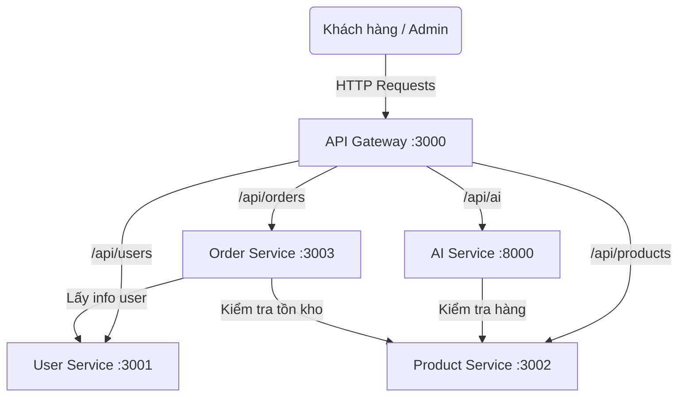

# 1_SYSTEM_ARCHITECTURE.md

## 1. Danh sách Microservices & Cổng chạy Local

Dự án **Smart Medicine Shop** sử dụng kiến trúc Microservices kết nối thông qua API Gateway. 

| Service Name       | Công nghệ          | Local Port | Chức năng chính                                        |
| ------------------ | ------------------ | ---------- | ------------------------------------------------------ |
| `api-gateway`      | Node.js / Express  | `3000`     | Cổng giao tiếp duy nhất, điều hướng request tới service |
| `user-service`     | Node.js / Express  | `3001`     | Quản lý xác thực (JWT), thông tin người dùng, RBAC      |
| `product-service`  | Node.js / Express  | `3002`     | Quản lý dược phẩm, tồn kho, tìm kiếm theo triệu chứng   |
| `order-service`    | Node.js / Express  | `3003`     | Xử lý giỏ hàng, đơn hàng, thanh toán, toa thuốc        |
| `ai-service`       | FastAPI / Python   | `8000`     | Phân tích ảnh đơn thuốc (Gemini API), gợi ý thông minh  |

---

## 2. Sơ đồ Kiến trúc Tổng quan (C4 Model)

## 3. Quy ước Giao tiếp (Inter-Service Communication)
- Các service giao tiếp với nhau qua chuẩn HTTP/REST nội bộ (định tuyến bằng localhost IP hoặc Docker container name nếu dùng Docker).
- **API Gateway** đóng vai trò bảo mật duy nhất mở ra Internet. Client / Web Frontend KHÔNG ĐƯỢC gọi trực tiếp vào Port 3001, 3002, v.v.
- Các Service có thể gọi chéo nhau. Ví dụ: `ai-service` chủ động gọi `product-service` để rà soát hàng trong kho.
